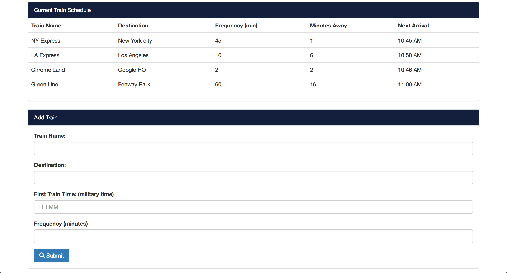

# Train Schedule

### Overview

In this assignment, the object was to create a train schedule application that incorporates Firebase to host arrival and departure data. My app retrieves and manipulates the data with Moment.js. This website provides up-to-date information about various trains, namely their arrival times and how many minutes remain until they arrive at their station.

### Link
[Train-Schedule](https://ricopella.github.io/train-schedule/)

### Example Site

